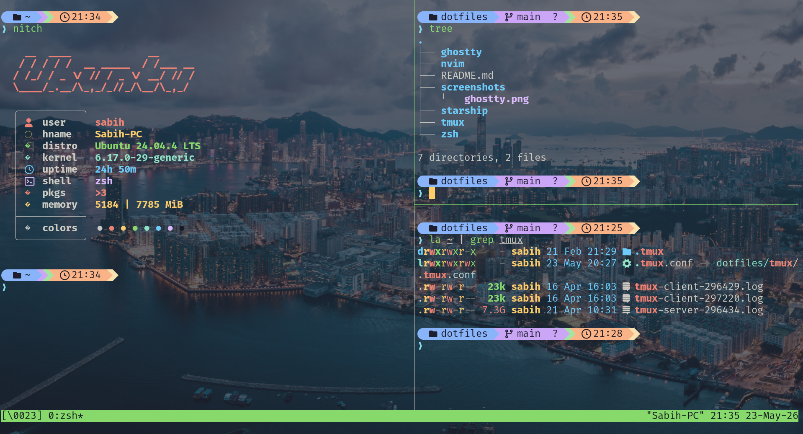

# Dotfiles

> Personal development environment configuration for **Ubuntu Linux**.
> Built for speed, minimalism, and a polished developer experience.


---

## Features

- **Ghostty** — GPU-accelerated terminal with Ayu Mirage theme, transparency, and blur
- **Neovim 0.12** — Clean, modern config using native `vim.pack` (no plugin manager)
- **Starship** — Catppuccin Mocha powerline prompt with language/runtime detection
- **Tmux** — Prefix `C-Space`, vi-mode, sessionizer, mouse support, Ctrl+Alt pane navigation
- **Zsh** — Modular config with Oh My Zsh, zoxide, fzf, direnv, mise, NVM

## Screenshots

> _Add your terminal screenshots here_

| Component | Preview |
|-----------|---------|
| Terminal  |  |
| Neovim    |  |
| Tmux      |  |

## Quick Start

```bash
# 1. Clone the repository
git clone https://github.com/sabihDev/dotfiles.git ~/dotfiles
cd ~/dotfiles

# 2. Install dependencies (see Installation section below)

# 3. Symlink configurations with GNU Stow
stow ghostty nvim tmux zsh starship
```

## Installation

### Prerequisites

```bash
sudo apt update
sudo apt install -y \
  git curl wget build-essential \
  stow ripgrep bat eza fzf zoxide \
  fontconfig fonts-firacode
```

### Tool Dependencies

| Tool | Install |
|------|---------|
| [Ghostty](https://ghostty.org) | `curl -sSf https://ghostty.org/install.sh \| sh` |
| [Neovim 0.12](https://github.com/neovim/neovim) | `curl -LO https://github.com/neovim/neovim/releases/latest/download/nvim-linux-x86_64.tar.gz && tar xzvf nvim-linux-x86_64.tar.gz && sudo cp -r nvim-linux-x86_64/* /usr/local/` |
| [Starship](https://starship.rs) | `curl -sS https://starship.rs/install.sh \| sh` |
| [Tmux](https://github.com/tmux/tmux) | `sudo apt install tmux` |
| [Zsh](https://zsh.sourceforge.io) | `sudo apt install zsh && chsh -s $(which zsh)` |
| [Oh My Zsh](https://ohmyz.sh) | `sh -c "$(curl -fsSL https://raw.githubusercontent.com/ohmyzsh/ohmyzsh/master/tools/install.sh)"` |
| [fzf](https://github.com/junegunn/fzf) | `sudo apt install fzf` |
| [zoxide](https://github.com/ajeetdsouza/zoxide) | `curl -sS https://webi.sh/zoxide \| sh` |
| [mise](https://mise.jdx.dev) | `curl https://mise.run \| sh` |
| [direnv](https://direnv.net) | `sudo apt install direnv` |
| [bun](https://bun.sh) | `curl -fsSL https://bun.sh/install \| bash` |
| [yazi](https://yazi-rs.github.io) | `cargo install --locked yazi-fm yazi-cli` |

### Zsh Plugins

```bash
# Install into Oh My Zsh custom plugins directory
git clone https://github.com/zsh-users/zsh-autosuggestions ${ZSH_CUSTOM:-~/.oh-my-zsh/custom}/plugins/zsh-autosuggestions
git clone https://github.com/zsh-users/zsh-syntax-highlighting ${ZSH_CUSTOM:-~/.oh-my-zsh/custom}/plugins/zsh-syntax-highlighting
git clone https://github.com/zsh-users/zsh-history-substring-search ${ZSH_CUSTOM:-~/.oh-my-zsh/custom}/plugins/zsh-history-substring-search
```

## Symlink Setup

This repo uses [GNU Stow](https://www.gnu.org/software/stow/) to manage symlinks.

```bash
# Symlink all configs at once
stow ghostty nvim tmux zsh starship

# Or symlink individually
stow ghostty    # ~/.config/ghostty/config
stow nvim       # ~/.config/nvim/
stow tmux       # ~/.tmux.conf
stow zsh        # ~/.zshrc, ~/.zsh/
stow starship   # ~/.config/starship/starship.toml

# Remove a symlink
stow -D nvim
```

### Manual Symlinks (without Stow)

```bash
ln -sf ~/dotfiles/ghostty/.config/ghostty/config ~/.config/ghostty/config
ln -sf ~/dotfiles/nvim/.config/nvim ~/.config/nvim
ln -sf ~/dotfiles/tmux/.tmux.conf ~/.tmux.conf
ln -sf ~/dotfiles/zsh/.zshrc ~/.zshrc
ln -sf ~/dotfiles/zsh/.zsh ~/.zsh
ln -sf ~/dotfiles/starship/.config/starship/starship.toml ~/.config/starship/starship.toml
```

## Directory Structure

```
dotfiles/
├── ghostty/
│   └── .config/ghostty/
│       └── config              # Ghostty terminal config
├── nvim/
│   └── .config/nvim/
│       ├── init.lua            # Entry point
│       ├── nvim-pack-lock.json # Native package lock
│       ├── lua/
│       │   ├── options.lua     # Editor options
│       │   ├── keymaps.lua     # Keybindings
│       │   ├── commands.lua    # Custom commands
│       │   ├── pack.lua        # Plugin management (vim.pack)
│       │   ├── treesitter.lua  # Tree-sitter parsers
│       │   ├── lsp.lua         # LSP + Mason config
│       │   ├── colors.lua      # Colorscheme picker
│       │   ├── statusline.lua  # Native statusline
│       │   └── transparency.lua # Transparent UI
│       └── backup/             # Previous config backups
├── tmux/
│   └── .tmux.conf              # Tmux configuration (symlinks to ~/.tmux.conf)
├── zsh/
│   ├── .zshrc                  # Shell entry point
│   └── .zsh/
│       ├── 0-env.zsh           # Environment variables
│       ├── 1-options.zsh       # Shell options
│       ├── 2-history-completion.zsh
│       ├── 3-plugins.zsh       # Oh My Zsh plugins
│       ├── 4-prompt.zsh        # Starship init
│       ├── 5-tools.zsh         # zoxide, direnv, mise, nvm
│       ├── 6-aliases.zsh       # Shell aliases
│       ├── 7-functions.zsh     # Custom functions
│       └── 8-misc.zsh          # Miscellaneous
├── starship/
│   └── .config/starship/
│       └── starship.toml       # Starship prompt theme
├── .gitignore
└── README.md
```

## Neovim Configuration

### Plugins (Native `vim.pack`)

| Plugin | Purpose |
|--------|---------|
| [mini.nvim](https://github.com/nvim-mini/mini.nvim) | Files, pick, diff, notify, surround, pairs, icons, completion, snippets, cmdline |
| [nvim-treesitter](https://github.com/nvim-treesitter/nvim-treesitter) | Syntax highlighting + parsing |
| [nvim-lspconfig](https://github.com/neovim/nvim-lspconfig) | LSP server configuration |
| [mason.nvim](https://github.com/mason-org/mason.nvim) | LSP/DAP/Formatter installer |
| [vim-fugitive](https://github.com/tpope/vim-fugitive) | Git integration |
| [obsidian.nvim](https://github.com/obsidian-nvim/obsidian.nvim) | Obsidian vault integration |
| [render-markdown.nvim](https://github.com/MeanderingProgrammer/render-markdown.nvim) | Markdown rendering |
| [rose-pine](https://github.com/rose-pine/neovim) | Default colorscheme |

### Keybindings

#### General

| Key | Action |
|-----|--------|
| `<Space>` | Leader key |
| `<C-c>` | Escape / Clear search highlight |
| `<leader>d>` | Delete without yanking |
| `<leader>s` | Replace word under cursor globally |
| `<leader>X` | Make file executable |
| `<leader>re` | Restart config |
| `<leader>u` | Toggle undo tree |

#### Navigation & Search

| Key | Action |
|-----|--------|
| `-` | Toggle mini.files |
| `<leader>-` | Open mini.files at current file |
| `<leader>pf` | File picker (mini.pick) |
| `<leader>ps` | Grep/search word under cursor |
| `<leader>fg` | Live grep (Telescope) |
| `<leader>vh` | Help picker |
| `<leader>xx` | Diagnostics picker |
| `<leader>pk` | Keymap search |

#### Neovim LSP

| Key | Action |
|-----|--------|
| `gd` | Go to definition |
| `<leader>f` | Format buffer |
| `df` | Show line diagnostics |

#### Obsidian Notes

| Key | Action |
|-----|--------|
| `<leader>nn` | New note (with prompt) |
| `<leader>nf` | Find note |
| `<leader>ng` / `<leader>ns` | Search notes |
| `<leader>nd` / `<leader>nt` | Daily / Today's note |
| `<leader>nb` | Backlinks |

#### Colorschemes

| Key | Action |
|-----|--------|
| `<leader>w` | Pick colorscheme |
| `:Colors` | Fuzzy pick and apply colorscheme |

Available themes: rose-pine-moon (default), moonfly, onedarkpro, nordic, tokyodark

## Tmux Configuration

### Keybindings

| Key | Action |
|-----|--------|
| `C-Space` | Prefix key |
| `C-b` | Secondary prefix |
| `prefix + q` | Reload config |
| `prefix + h` | Split vertical (pane below) |
| `prefix + v` | Split horizontal (pane right) |
| `prefix + x` | Kill pane |
| `prefix + f` | Open sessionizer |
| `prefix + L` | Switch to last session |
| `prefix + c` | New window |
| `prefix + k` | Kill window |
| `prefix + r` | Rename window |
| `prefix + C` | New session |
| `prefix + K` | Kill session |
| `prefix + P/N` | Previous/Next client |
| `prefix + R` | Rename session |
| `M-1` to `M-9` | Select window by number |

### Pane Navigation

| Key | Action |
|-----|--------|
| `C-M-Left/Right/Up/Down` | Move between panes |
| `C-M-S-Left/Right/Up/Down` | Resize panes |

### Copy Mode (vi)

| Key | Action |
|-----|--------|
| `prefix + [` | Enter copy mode |
| `v` | Begin selection |
| `y` | Copy selection |

## Starship Prompt

Catppuccin Mocha powerline-style prompt with segmented colors:

```
  󰉋 ~/project   main   v22.0  v3.12   14:30   2s 
 ❯
```

Segments: Directory (blue) → Git branch/status (lavender) → Languages (green) → Time (orange) → Duration (yellow)

## Fonts & Terminal Requirements

| Requirement | Details |
|-------------|---------|
| **Font** | JetBrainsMono Nerd Font (recommended) or Fira Code |
| **Nerd Font** | Required for icons in Starship, mini.icons, and prompt |
| **Terminal** | Ghostty (primary), any true-color terminal with Nerd Font support |
| **True Color** | Required for theme rendering |

### Install Nerd Fonts

```bash
# JetBrainsMono Nerd Font
mkdir -p ~/.local/share/fonts
cd ~/.local/share/fonts
wget https://github.com/ryanoasis/nerd-fonts/releases/latest/download/JetBrainsMono.tar.xz
tar -xf JetBrainsMono.tar.xz
fc-cache -fv
```

## Zsh Configuration

### Aliases

| Alias | Command |
|-------|---------|
| `n` / `vi` | `nvim` |
| `gs` / `ga` / `gc` / `gp` | Git shortcuts |
| `update` | `sudo apt update && upgrade && autoremove` |
| `ls` / `ll` / `la` | `eza` with icons and colors |
| `cat` | `bat` (syntax-highlighting cat) |
| `grep` | `rg` (ripgrep) |
| `cd` | `z` (zoxide smart cd) |
| `yazi` | `yazi_cd` (cd on exit) |
| `weather` | `curl wttr.in/Lahore` |

### Functions

| Function | Description |
|----------|-------------|
| `s` | Fuzzy file search with rg + nvim preview |
| `c` | Fuzzy directory picker via zoxide |
| `run` | Run files by extension (c, py, go, js, ts, java) |

## Secrets Management

Personal secrets (API keys, tokens, private exports) should **never** be committed.

Create a local secrets file that is sourced but excluded from git:

```bash
mkdir -p ~/.config/secrets
cat > ~/.config/secrets/env << 'EOF'
# Your private environment variables
# export GITHUB_TOKEN=ghp_xxx
# export AWS_ACCESS_KEY_ID=xxx
EOF
chmod 600 ~/.config/secrets/env
```

## License

MIT
